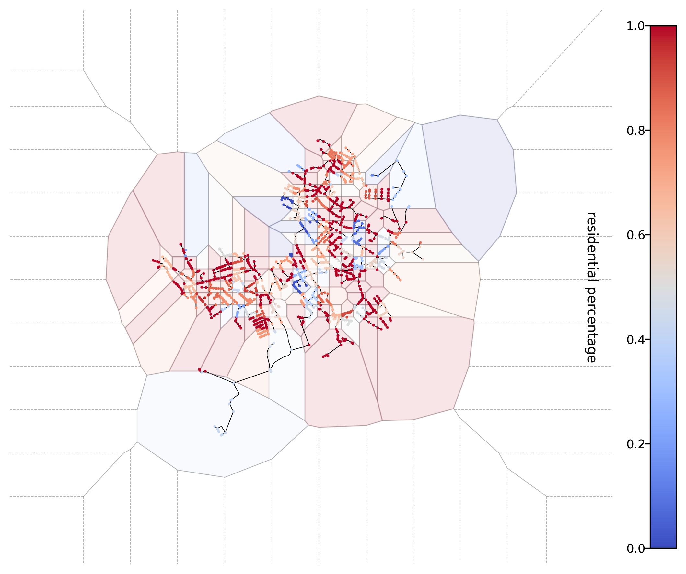
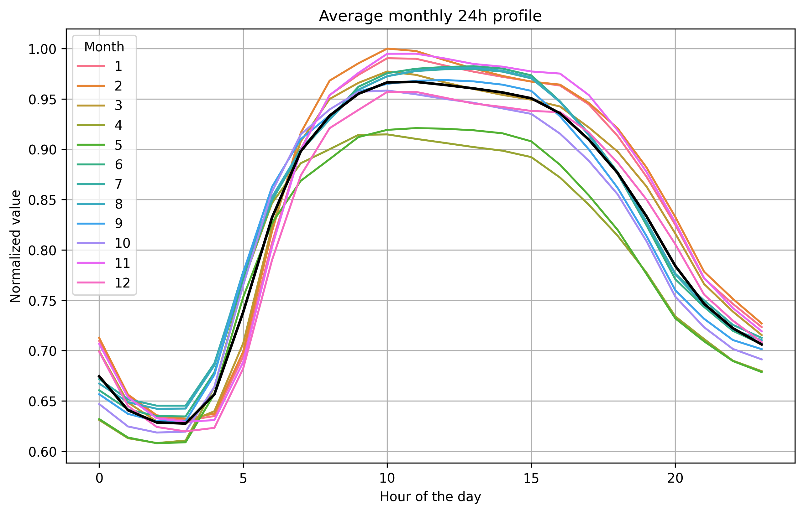
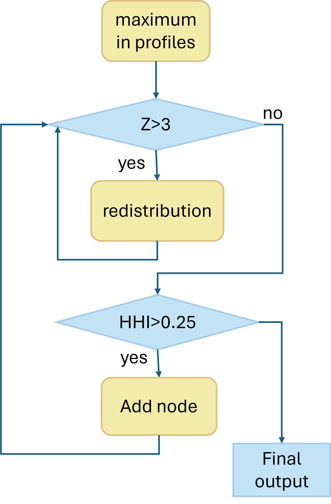

## SwissPDGs-TimeSeries

In this project, we aim to generate time series for the Swiss power distribution grids data set. The time-series data can be divided into MV basic load profile, LV basic load profile, PV load profile, heat pump profile and EV profile. Next we will introduce all the time profile in details.

### LV basic load profile
The time series demand profile for each grid is generated through the following processes. Since industrial load data is missing, we only consider commercial and residential loads in this project:

1. **Percentage Assignment**: The demand composition of each node in each LV grid is calculated using Voronoi partitioning based on the load percentage data from the `x_el_dmd.json` file.
2. **Standard Profile Generation**: The standard 24-hour residential and commercial profiles for each municipality are generated by calculating the weighted average of the residential and commercial profiles.
3. **Combination**: The time series profile of a node is generated by multiplying the load percentage of the node by the standard profiles of the municipality in which the node is located:

```math
\text{profile} = \text{res\_percentage} \times \text{res\_profile} + \text{com\_percentage} \times \text{com\_profile}
```

Next, each process and the assumptions made will be explained in detail.

### Percentage Assignment

There are a total of 2,148 municipalities, each with an `el_dmd.json` profile that provides load percentage data for each small area within the municipality. Additionally, we have grid data for each municipality, where each node in the grids represents the aggregated buildings in a small area. Our task is to assign a load percentage to each node. The code to perform this task is in `allocation.py`.

- Fill empty percentage values in `el_dmd.json` with 0.
- Each `el_dmd.json` file provides load percentages at certain representative load points. The number of load points is denoted by \(a\).
  - For \(a > 2\), we use Voronoi partitioning to divide the municipality based on the locations of each point. We add auxiliary nodes without load information at the periphery, far enough from the original points, to close all the partitioned areas. We then assign the load percentage of each point to the nodes in its partitioned area. For nodes located outside all partitioned areas, the load percentage of the nearest load point is assigned.
  - For \(a \leq 2\), the points are insufficient for Voronoi partitioning. In this case, we simply assign each node in the grid the load percentage of the nearest load point.
- After the allocation, the residential percentage and commercial percentage of each node is saved in the original grid JSON file.

The Voronoi partitioning and assignment are illustrated in the figure below. The color of each node represents its demand composition.




### Standard Profile Generation

- We categorized demand profiles by demand source and their construction period. The table below shows the categories. Then we counted the number of each type of demand in each municipality and computed weighted average demand curves accordingly. It is worth mentioning that this demand is 8760 hours, while we need to calculate the profile of millions of nodes, which is a big data storage and computational challenge, so in the next step, we calculated representative 24-hour profiles from this yearly profile.

| Load Type     | Residential                | Commercial                                      |
|---------------|----------------------------|-------------------------------------------------|
| Building Type | Single-family house        | School, Hospital, Offices, Shops, Restaurants   |
| Period        | Before 1920, 1920-1945, 1946-1960, 1961-1970, 1971-1980, 1981-1985, 1986-1990, 1991-1995, 1996-2000, 2001-2005, 2006-2010, 2011-2015 | Before 1920, 1920-1945, 1946-1960, 1961-1970, 1971-1980, 1981-1985, 1986-1990, 1991-1995, 1996-2000, 2001-2005, 2006-2010, 2011-2015 |

- After generating a yearly residential and commercial profile for each municipality, we further processed the yearly profile to get a representative daily profile to reduce data redundancy.
  - For the commercial demand profile, since it has significant seasonal differences, we use k-means to cluster the 365 daily profiles into several clusters. The number of clusters is determined by choosing the best silhouette score. 
  - For the residential demand profile, it doesn't have significant seasonal differences. We calculated an average daily profile using the yearly profile.
- Demand profiles for some municipalities are missing, we fill the missing profiles with average profile of other municipalities.
- Finally, the daily residential and commercial profiles are normalized to the range 0-1.

### Combination

The results derived in step 1 and step 2 are combined together, and the demand profile in each node can be calculated by the following formula:

```math
\text{profile} = \text{res\_percentage} \times \text{res\_profile} + \text{com\_percentage} \times \text{com\_profile}
```

Here is an example of how to generate the demand profile for a grid. You can copy the code below or run the code in `example.ipynb`.

```python
import pickle
import pandas as pd
import numpy as np
import geopandas as gpd
import os
import tqdm
import json
import warnings
import matplotlib.pyplot as plt

warnings.filterwarnings('ignore')

grid_id = '2'
# read folder dictionary
with open('data_processing/dict_folder.json') as f:
    folders = json.load(f)
# read the profile
with open('municipality_profiles/commercial_profile_k-means.pkl', 'rb') as f:
    commercial_profile_kmean = pickle.load(f)
residential_profile = pd.read_csv('municipality_profiles/residential_profiles_24h.csv', index_col=0)
commercial_profile = pd.read_csv('municipality_profiles/commercial_profiles_24h.csv', index_col=0)
commercial_profile_day = commercial_profile_kmean[grid_id]['profile'].reshape(-1, 24)
counts = commercial_profile_kmean[grid_id]['counts']
repeated_profiles = [profile for profile, count in zip(commercial_profile_day, counts) for _ in range(count)]
np.random.shuffle(repeated_profiles)
commercial_profile_year = np.concatenate(repeated_profiles)
residential_profile_day = np.array(residential_profile[grid_id])
residential_profile_year = np.tile(residential_profile_day, 365)
```

```python
path = 'LV/' + folders[grid_id] + '/'
grid_ids = list(set([str(f.split('.')[0][:-6]) for f in os.listdir(path) if f.startswith(grid_id + '-')]))
print("Processing grid {} in municipality {}".format(grid_id, folders[grid_id]))
for n in tqdm.tqdm(range(len(grid_ids))):
    i = grid_ids[n]
    node_id = i + "_nodes"
    nodes = gpd.read_file('LV/' + folders[grid_id] + '/' + node_id)
    nodes['profile'] = {}
    for iter, row in nodes.iterrows():
        combined_profile = row['res_percentage'] * residential_profile_year + row['com_percentage'] * commercial_profile_year
        nodes.at[iter, 'profile'] = combined_profile
    # create folder LV_with_profiles if it does not exist
    if not os.path.exists('LV_with_profiles/' + folders[grid_id]):
        os.makedirs('LV_with_profiles/' + folders[grid_id])
    save_path = 'LV_with_profiles/' + folders[grid_id] + '/' + i + '_nodes'
    nodes.to_pickle(save_path)
```
### MV profiles
To obtain the MV basic time-series load profile, we identified the time-series demand profile at the MV level and chose to use the demand profile of [Zurich](https://opendata.swiss/de/dataset/viertelstundenwerte-zur-stromabgabe-in-den-netzebenen-5-und-7-in-der-stadt-zurich-seit-2010). This dataset provides a clear separation between MV and LV demand, with a resolution of 15-minute intervals.

For greater efficiency and accuracy, we normalized the data to a 0-1 scale and calculated the average 24-hour demand profile from 2015 to 2023. The processed data is stored in the folder MV_basic_monthly_24h_profile, and the resulting trend is illustrated in the figure below. 


### PV profiles
The PV profiles for Swiss grid is generated based on the data provided by [Alina Walch et al.](https://www.sciencedirect.com/science/article/pii/S0306261919320914). We utilize the following files: rooftop_PV_CH_annual_by_building.csv, rooftop_PV_CH_EPV_W_by_building.csv, and rooftop_PV_CH_EPV_W_std_by_building.csv. A detailed description of this data is available at [data description](https://zenodo.org/records/3609833). This dataset provides a 24-hour PV generation profile for each building, with hourly intervals for each month of the year, along with associated uncertainties. We calculate an average 24-hour profile by using the 12 representative days in each month.

To allocate the PV buildings, we apply Voronoi partitioning to each MV grid, using a buffer distance. The buffer distance influences how PV buildings are assigned to MV nodes. The impact of varying buffer distances is shown in the table below. The allocation results for each node are stored in the "PV_allocation_results" folder. In this folder, x_demand.pkl represents the PV demand profile allocated to grid "x," while x_std.pkl represents the uncertainty of that demand. The unit of the demand and uncertainty is W. 

| Buffer distance (m) | MV_grids involved | Unmapped building (%)|Unmapped energy (%)|
| ------- | ------- |------- |------- |
|3000     |747      |2.513   |1.933|
|5000     |653      |0.922   |0.652|
|8000	  |541	    |0.486	 |0.263|
|10000    |501      |0.232   |0.117|
After the allocation, we found that the allocation of some of the grids are extremely imbalance and concentrated. We employ Z-score and HHI index to characterize the deviation and concentration extend of the allocation in a grid, and then re-distribute the PV injection of the node with Z-score bigger than 3 to other normal node to balance to allocation. For higher concentrated grid, we add new node step by step until $HHI<0.25$. The flow chart of this process is shown in the figure below. 

### Heat pump profiles
### EV profiles
### Directory Structures

```plaintext
.
├── data_processing
│   └── [Scripts and data for preprocessing raw input data]
├── Demand_calculator
│   └── [Scripts for calculating electrical demand based on various profiles and parameters]
├── LV
│   └── [Low-voltage network data, including node and connection information]
├── municipality_profiles
│   └── [Standard profiles for different municipalities]
│   ├── commercial_profile_k-means.pkl
│   │     └── [Serialized k-means clustering model for typical daily commercial profiles]
│   ├── commercial_profiles_24h.csv
│   │     └── [CSV file with average daily commercial profiles over a year]
│   ├── residential_profiles_24h.csv
│         └── [CSV file with average daily residential profiles over a year]
├── Square_zones_dmd
│   └── [Data and scripts for analyzing demand in square zones]
├── allocation.py
│   └── [Script for percentage-based allocation processes]
├── example.ipynb
│   └── [Example Jupyter notebook demonstrating how to generate demand profiles for each node in a grid]
├── profile_assignment.py
│   └── [Script for identifying typical days in a year and assigning profiles to nodes within the low-voltage network. Use `example.
├── MV_basic_monthly_24h_profile
│
ipynb` for generating profiles for a single grid rather than a batch process]
```

